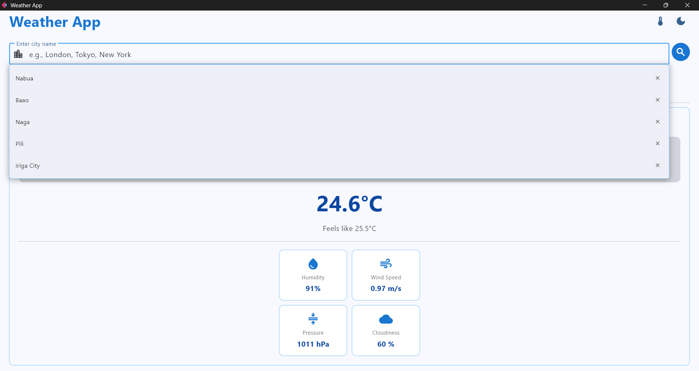
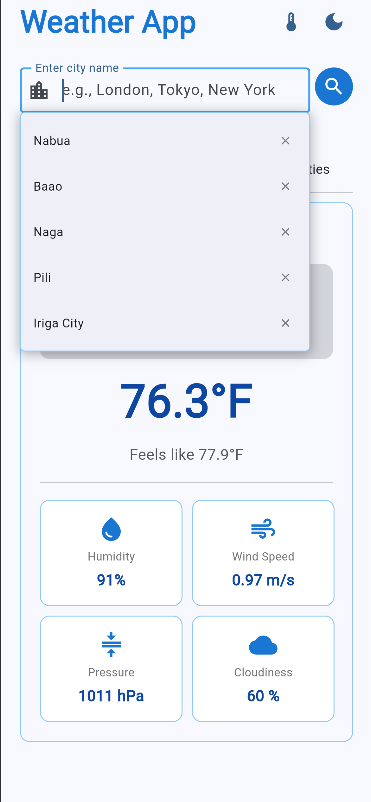
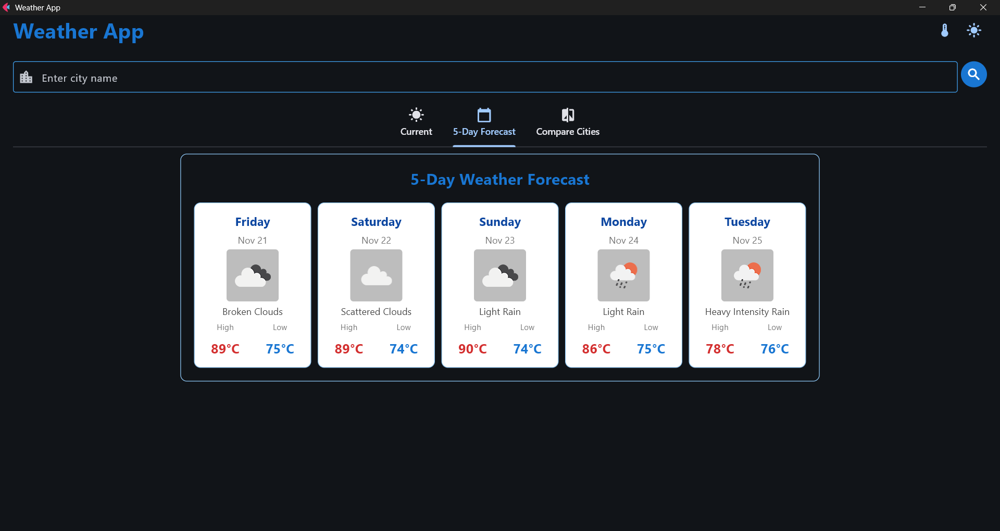
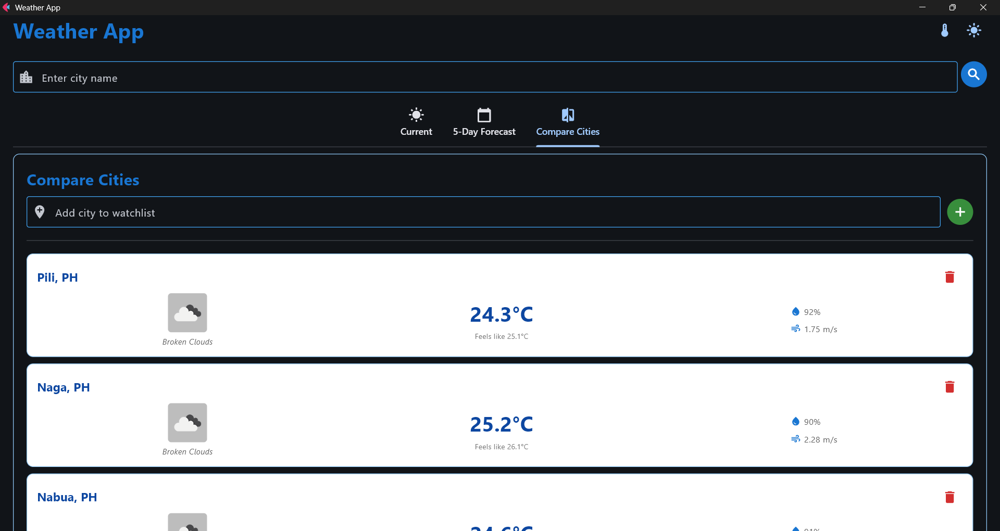
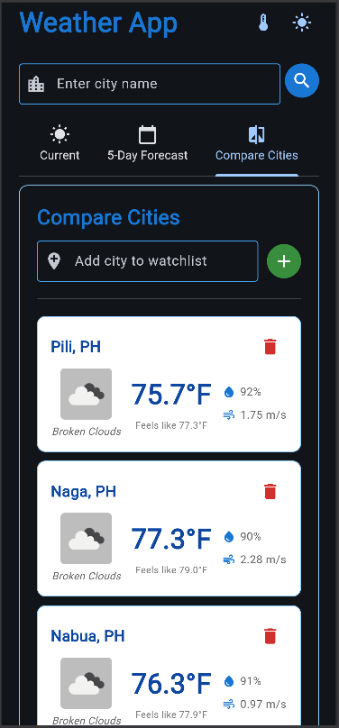
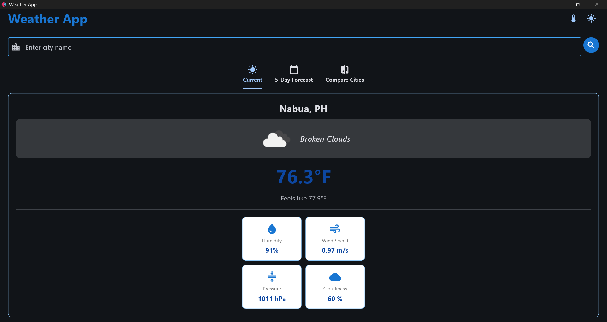
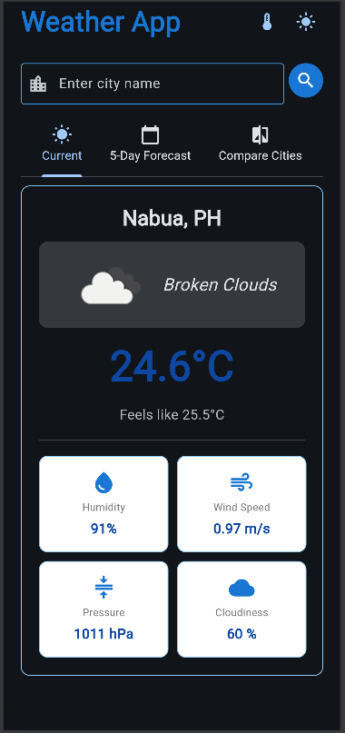

# Weather Application - Module 6 Lab

## Student Information
- **Name**: Vince Clifford C. Aguilar
- **Student ID**: 231002270
- **Course**: CCCS 106
- **Section**: BSCS 3B

## Project Overview
This Weather App is a lightweight multi-platform application built with Flet that provides current weather information and a 5-day forecast for cities worldwide using the OpenWeatherMap API. It supports quick city search with a persistent search history, temperature unit preferences (Celsius/Fahrenheit), and a watchlist for comparing multiple cities side-by-side. The UI follows Material Design principles for a clean, accessible experience, and user preferences and lists are stored locally in small JSON files so settings persist between sessions.

## Features Implemented

### Base Features
- [/] City search functionality
- [/] Current weather display
- [/] Temperature, humidity, wind speed
- [/] Weather icons
- [/] Error handling
- [/] Modern UI with Material Design

### Enhanced Features
1. **City Search with Suggestions & History**
   - Description: Real-time city search with autocomplete suggestions derived from the user's recent searches. Clicking a suggestion fills the input and triggers the search. The app keeps the last 10 searches in `search_history.json` and surfaces them when the input is focused.
   - Why chosen: Frequent users can quickly re-run recent searches without retyping, improving usability and speed when checking multiple locations.
   - Challenges & solutions: Handling partial or mistyped city names and avoiding noisy suggestions required normalizing input and filtering the stored history case-insensitively. To prevent duplicates and keep the list small, new entries are moved to the top and the list is truncated to 10 items. I also had difficulty making the suggestions container float so it wouldn't push other UI elements downward when it appeared; I resolved this by rendering the suggestions as an overlay (for example, using `page.overlay.append(self.suggestions_container)`) and adjusting positioning so the suggestions display above the page content without affecting layout flow.

2. **Unit Preference (Celsius / Fahrenheit)**
   - Description: Users can toggle temperature units between Celsius and Fahrenheit. The preference is saved to `unit_preference.json` and applied to all displays (current weather, forecast, comparison cards).
   - Why chosen: Different users and regions expect different units; providing a persistent preference improves clarity and personalization.
   - Challenges & solutions: Converting and re-rendering temperatures across multiple views (current, forecast, comparison) required a central conversion helper and triggering UI refreshes after the unit change. The app stores the underlying metric values and converts on display so switching units is fast and accurate.

3. **5-Day Forecast (3-hour intervals aggregated to daily summaries)**
   - Description: The app fetches the 5-day forecast (3-hour intervals) and aggregates the data into clear daily summaries for temperature, weather description, and an icon for each day.
   - Why chosen: A short multi-day forecast helps users plan ahead and is a common expectation for weather apps beyond just current conditions.
   - Challenges & solutions: The API returns many interval entries per day; grouping them into useful daily summaries required parsing timestamps, calculating min/max temperatures per day, and selecting representative icons/descriptions. This aggregation logic is implemented in the forecast display routine to keep the UI concise and readable.

4. **Multiple Cities Comparison (Watchlist)**
   - Description: Users can add cities to a watchlist and view a comparison screen that shows current weather for each watched city in compact cards (temperature, condition, humidity, wind).
   - Why chosen: Comparing multiple locations at a glance is valuable for planning travel, monitoring loved ones' weather, or tracking several places of interest.
   - Challenges & solutions: Keeping the comparison view performant when fetching multiple API endpoints simultaneously required batching asynchronous requests and caching recent results in memory. The watchlist is persisted to `watchlist.json`, and the UI gracefully handles missing or failed fetches by showing per-card error messages without blocking other cards from loading.

## Screenshots
##### Search Suggestions
<table>
   <tr>
      <td></td>
      <td></td>
   </tr>
</table>

##### Dark Mode
<table>
   <tr>
      <td></td>
      <td></td>
   </tr>
</table>

##### 5-Day Forecast Tab
<table>
   <tr>
      <td></td>
      <td></td>
   </tr>
</table>

##### Compare Cities Tab
<table>
   <tr>
      <td></td>
      <td></td>
   </tr>
</table>

##### Change Unit Preference
<table>
   <tr>
      <td></td>
      <td></td>
   </tr>
</table>

## Installation

### Prerequisites
- Python 3.8 or higher
- pip package manager

### Setup Instructions
```bash
# Clone the repository
git clone https://github.com/clepord34/cccs106-projects.git
cd cccs106-projects/mod6_labs

# Create virtual environment
python -m venv venv
source venv/bin/activate  # On Windows: venv\Scripts\activate

# Install dependencies
pip install -r requirements.txt

# Create .env file
cp .env.example .env
# Add your OpenWeatherMap API key to .env