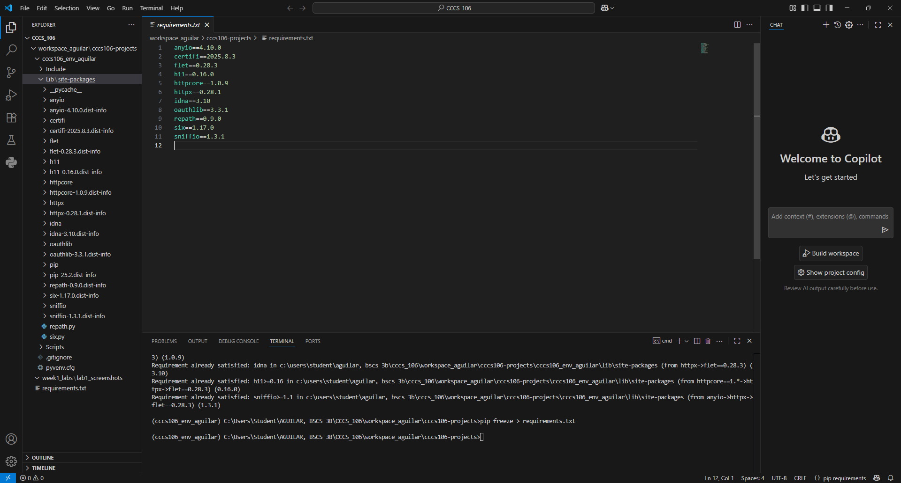
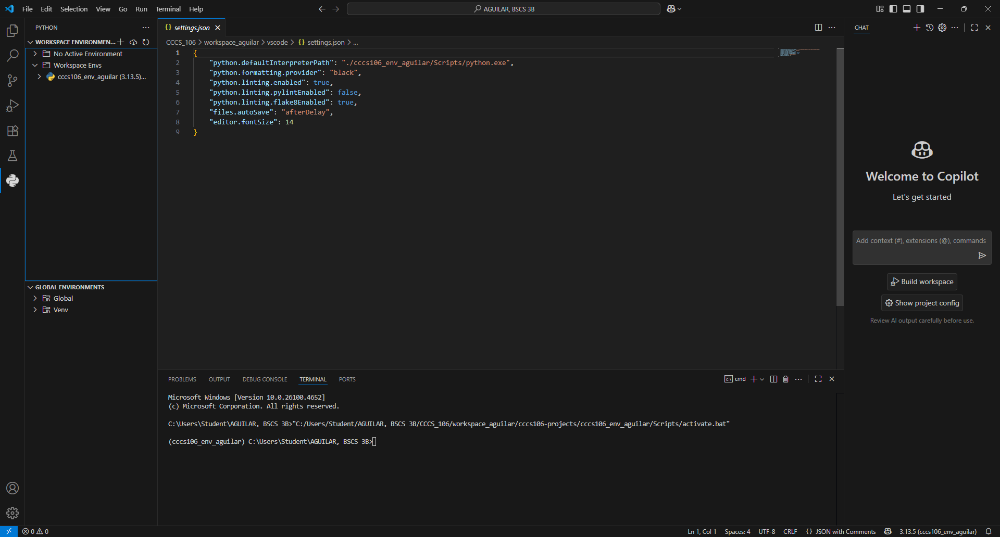
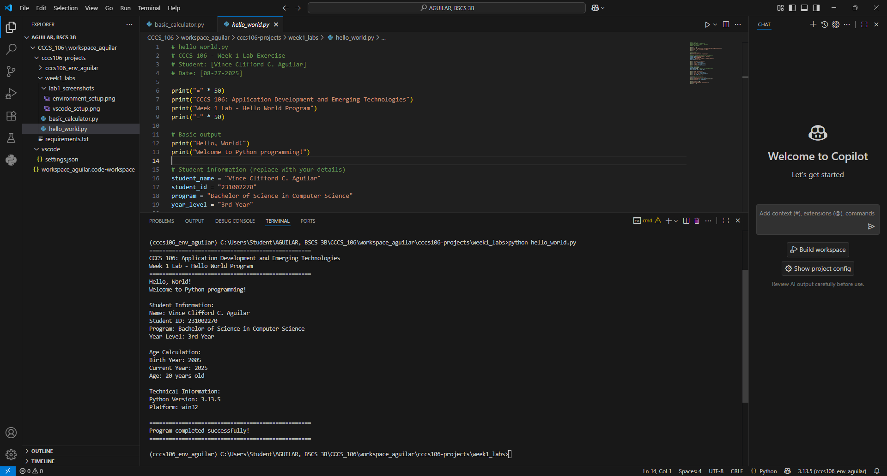
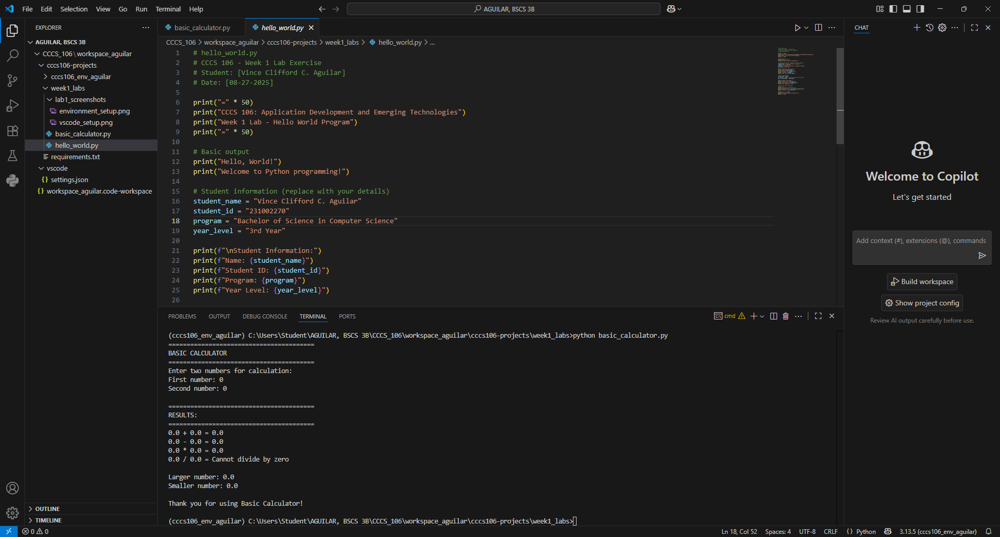

# Lab 1 Report: Environment Setup and Python Basics

**Student Name:** Vince Clifford C. Aguilar
**Student ID:** 231002270
**Section:** BSCS 3B
**Date:** 08-27-2025

## Environment Setup

### Python Installation
- **Python Version:** 3.13.5
- **Installation Issues:** None, python was already installed
- **Virtual Environment Created:** ✅ cccs106_env_lastname

### VS Code Configuration
- **VS Code Version:** 1.103.2
- **Python Extension:** ✅ Installed and configured
- **Interpreter:** ✅ Set to cccs106_env_aguilar/Scripts/python.exe

### Package Installation
- **Flet Version:** 0.28.3
- **Other Packages:** List any additional packages

## Programs Created

### 1. hello_world.py
- **Status:** ✅ Completed
- **Features:** Student info display, age calculation, system info
- **Notes:** None

### 2. basic_calculator.py
- **Status:** ✅ Completed
- **Features:** Basic arithmetic, error handling, min/max calculation
- **Notes:** None

## Challenges and Solutions

I had trouble showing the interpreter in the bottom status bar. The problem was I did not create a python file that is why it was not appearing.

## Learning Outcomes

I have learned again how to create a virtual environment which I always forget how to set it up and its importance on why we need to do it.

## Screenshots

 
 
