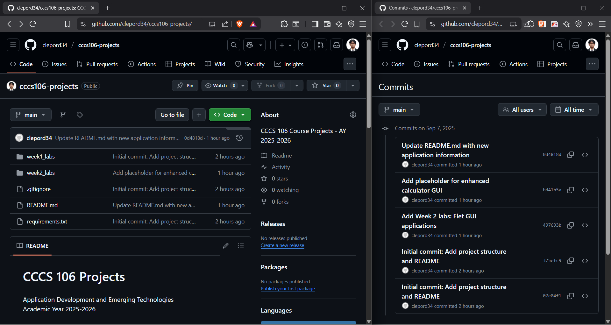
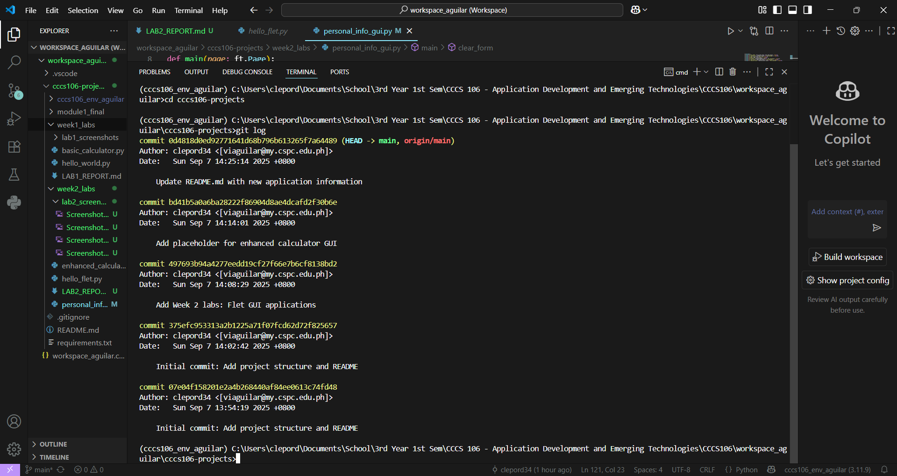
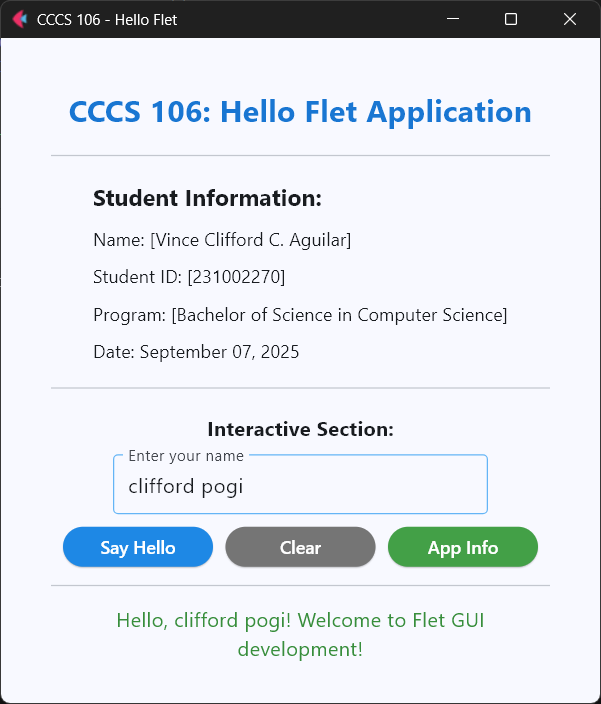
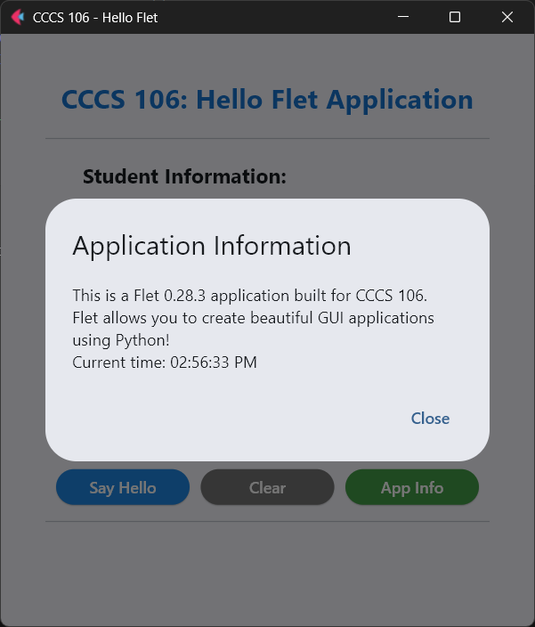
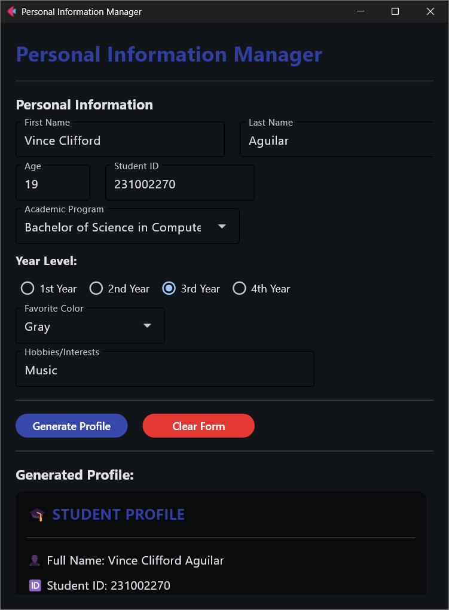
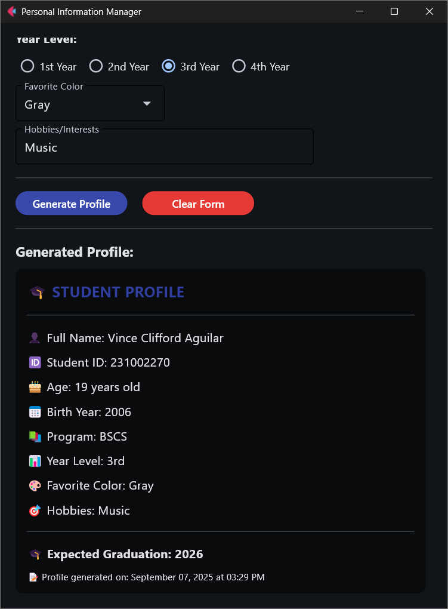

# Lab 2 Report: Git Version Control and Flet GUI Development

- **Student Name:** Vince Clifford C. Aguilar
- **Student ID:** 231002270
- **Section:** BSCS-3B
- **Date:** 09-07-2025

## Git Configuration

### Repository Setup
- **GitHub Repository:** https://github.com/clepord34/cccs106-projects/
- **Local Repository:** ✅ Initialized and connected
- **Commit History:** 5 commits with descriptive messages

### Git Skills Demonstrated
- ✅ Repository initialization and configuration
- ✅ Adding, committing, and pushing changes
- ✅ Branch creation and merging
- ✅ Remote repository management

## Flet GUI Applications

### 1. hello_flet.py
- **Status:** ✅ Completed
- **Features:** Interactive greeting, student info display, dialog boxes
- **UI Components:** Text, TextField, Buttons, Dialog, Containers
- **Notes:** App Info button not working. Nothing pops up or alert dialogue not displaying

### 2. personal_info_gui.py
- **Status:** ✅ Completed
- **Features:** Form inputs, dropdowns, radio buttons, profile generation
- **UI Components:** TextField, Dropdown, RadioGroup, Containers, Scrolling
- **Error Handling:** Input validation and user feedback
- **Notes:** Text visibility is not good

## Technical Skills Developed

### Git Version Control
- Understanding of repository concepts
- Basic Git workflow (add, commit, push)
- Branch management and merging
- Remote repository collaboration

### Flet GUI Development
- Flet 0.28.3 syntax and components
- Page configuration and layout management
- Event handling and user interaction
- Modern UI design principles

## Challenges and Solutions
- In `hello_flet.py`, the "App Info" button was not working (the alert dialogue was popping up).
    - Solution: Updated some functions. In line 76, `close_dialog(dialog)` was changed to `page.close(dialog)`. Then, replaced lines from 81 to 83 to `page.open(dialog)` and removed the function `close_dialog(dialog)` located at line 85.
- In `personal_info_gui.py`, the background color of the output box were too bright for the text.
    - Solution: Changed the background color from gray to black to make the texts more visible. Changes were at line 71 (`Colors.GREY_100` to `Colors.BLACK45`) and 105 (removed `color=ft.Colors.GREY_600`).
- Flet desktop app is not displaying on virtual environment but in web browser and global environment/interpreter it is working just fine. No solutions found yet. Tried reinstalling flet and python; downgraded python from 3.13 to 3.11; and redoing the whole project starting from week 1.
    - Solution: Moved `CCCS106` folder from the `School` directory to the Desktop, then re-set up the virtual environment.

## Learning Outcomes

In this lab, I learned how to set up and use Git for version control, including configuring my account, creating repositories, making commits, and pushing changes to GitHub. I also practiced creating and merging branches to manage project updates. On the development side, I learned how to build simple GUI applications using the Flet framework. I was able to design layouts, add interactive components like text fields, buttons, and dropdowns, and handle user input with validation. This lab helped me understand both the basics of project management with Git and how to create user-friendly applications with Flet.

## Screenshots

### Git Repository
- 
GitHub repository with commit history

- 
Local git log showing commits

### GUI Applications
-  

hello_flet.py running with all features

###

-  

personal_info_gui.py with filled form and generated profile

## Future Enhancements

I plan to make the applications more useful and polished. For the personal information manager, I would like to add options for saving and editing profiles, as well as uploading a profile picture. The Hello Flet app could also be improved with a dark mode option and some simple animations to make it more engaging.